# PersonalWebPageManagementSystem

A modern .NET 9.0 web application built with **Clean Architecture** principles that offers multiple UI options for creating and managing personal web pages and resumes.


## 🏗️ Clean Architecture Overview

This project follows Clean Architecture principles with clear separation of concerns and dependency inversion:

```mermaid
graph TB
    subgraph "🎨 Presentation Layer"
        WR[Web.Razor<br/>📄 Razor Pages]
        WB[Web.Blazor<br/>⚡ Interactive Components]
        PR[Presentation<br/>🔄 ViewModels & Mappers]
    end
    
    subgraph "💼 Application Layer"
        AS[Application Services<br/>📋 Business Logic]
        DTO[DTOs<br/>📦 Data Transfer Objects]
        IS[Service Interfaces<br/>🔌 Contracts]
    end
    
    subgraph "🏗️ Infrastructure Layer"
        EF[Entity Framework<br/>🗄️ Data Access]
        REPO[Repositories<br/>📚 Data Operations]
        DI[Dependency Injection<br/>⚙️ Configuration]
    end
    
    subgraph "🎯 Domain Layer"
        ENT[Entities<br/>👤 Resume, Experience, etc.]
        INT[Interfaces<br/>🔗 Repository Contracts]
    end

    %% Dependencies (arrows point toward dependencies)
    WR --> PR
    WB --> PR
    PR --> AS
    AS --> IS
    AS --> DTO
    REPO --> INT
    EF --> ENT
    DI --> REPO
    AS --> INT
    
    %% Styling
    classDef presentation fill:#e1f5fe,stroke:#01579b,stroke-width:2px
    classDef application fill:#f3e5f5,stroke:#4a148c,stroke-width:2px
    classDef infrastructure fill:#e8f5e8,stroke:#1b5e20,stroke-width:2px
    classDef domain fill:#fff3e0,stroke:#e65100,stroke-width:2px
    
    class WR,WB,PR presentation
    class AS,DTO,IS application
    class EF,REPO,DI infrastructure
    class ENT,INT domain
```



### 🎯 Architecture Benefits

- **🔄 Separation of Concerns**: Each layer has a single responsibility
- **🔌 Dependency Inversion**: Core logic independent of external concerns
- **🧪 Testability**: Business logic can be tested in isolation
- **🔀 Flexibility**: Easy to swap UI technologies or data sources
- **📦 Maintainability**: Clear structure for easy development and maintenance

## ✨ Features

### 🎨 **Dual UI Options**
- **Razor Pages**: Traditional server-rendered pages (SEO-optimized)
- **Blazor Server**: Modern interactive components with real-time updates

### 💼 **Resume Management**
- **Personal Details**: Comprehensive profile information
- **Employment History**: Dynamic work experience entries
- **Education**: Academic background tracking
- **Skills**: Professional competencies with levels
- **Live Preview**: Real-time preview while editing (Blazor)

### 🚀 **Technical Features**
- **Clean Architecture**: Maintainable, testable, scalable design
- **Responsive Design**: Works perfectly on all devices
- **Data Persistence**: SQLite (dev) / SQL Server (prod)
- **Form Validation**: Comprehensive client/server validation
- **Hot Reload**: Immediate feedback during development


## 🛠️ Technology Stack

### **Backend**
- **.NET 9.0**: Latest framework with performance improvements
- **ASP.NET Core**: Dual UI support (Razor Pages + Blazor Server)
- **Entity Framework Core**: Modern ORM with migrations
- **Clean Architecture**: Separation of concerns with DI

### **Frontend**
- **Blazor Server**: Interactive components with SignalR
- **Razor Pages**: SEO-optimized server-rendered pages
- **Bootstrap 5**: Responsive design framework
- **Modern CSS**: Clean, accessible styling

### **Database**
- **SQLite**: Development database (file-based)
- **SQL Server**: Production-ready option
- **Code-First Migrations**: Schema versioning

## 🚀 Getting Started

### 📋 Prerequisites

- [**.NET 9.0 SDK**](https://dotnet.microsoft.com/download/dotnet/9.0) or later
- [**Visual Studio 2022**](https://visualstudio.microsoft.com/) or [**Visual Studio Code**](https://code.visualstudio.com/)

### ⚡ Quick Start

1. **Clone the repository**
   ```bash
   git clone https://github.com/bobgeorg/PersonalWebPageManagementSystem.git
   cd PersonalWebPageManagementSystem
   ```

2. **Restore dependencies**
   ```bash
   dotnet restore
   ```

3. **Build the solution**
   ```bash
   dotnet build PersonalWebPageManagementSystem.sln
   ```

4. **Choose your UI experience:**

   **🎨 Blazor Server (Recommended - Interactive)**
   ```bash
   dotnet run --project PersonalWebPageManagementSystem.Web.Blazor
   ```
   Navigate to: `https://localhost:5157`

   **📄 Razor Pages (Traditional - SEO Optimized)**
   ```bash
   dotnet run --project PersonalWebPageManagementSystem.Web.Razor
   ```
   Navigate to: `https://localhost:5113`

### 🛠️ Development Mode

**Hot reload for instant feedback:**
```bash
# Blazor Server with hot reload
dotnet watch --project PersonalWebPageManagementSystem.Web.Blazor

# Razor Pages with hot reload
dotnet watch --project PersonalWebPageManagementSystem.Web.Razor
```

### 💾 Database Setup

The application automatically creates a SQLite database (`WPMS.db`) on first run. No additional setup required for development!

## Configuration

### Database Connections

The application supports two database configurations:

- **Development**: SQLite database (`WPMS.db`) - automatically created
- **Production**: SQL Server - configure connection string in `appsettings.json`

### Connection Strings

Update `appsettings.json` for your environment:

```json
{
  "ConnectionStrings": {
    "WPMSContextSQLite": "Data Source=WPMS.db",
    "WPMSContextSQLServer": "Server=(localdb)\\mssqllocaldb;Database=WPMS;Trusted_Connection=True;MultipleActiveResultSets=true"
  }
}
```

## Project Structure

```
PersonalWebPageManagementSystem/
├── Data/                          # Entity Framework DbContext
├── Models/                        # Domain models (Resume, Education, etc.)
├── ViewModels/                    # ViewModels for forms and validation
├── Pages/                         # Razor Pages
│   ├── Index.cshtml              # Main resume display page
│   ├── BuildResume.cshtml        # Resume editing form
│   └── Shared/                   # Shared layouts and partials
├── wwwroot/                      # Static files
│   ├── css/                      # Stylesheets
│   ├── js/                       # JavaScript files
│   ├── lib/                      # Client libraries (Bootstrap, jQuery)
│   └── Images/                   # Image assets
├── appsettings.json              # Configuration
└── Program.cs                    # Application startup
```

## Usage

1. **View Resume**: Visit the homepage to see the current resume
2. **Edit Resume**: Click "Edit Resume" to modify personal details, add employment history, education, and skills
3. **Add Employment**: Use the dynamic form to add multiple work experiences
4. **Upload Photo**: Upload a profile picture through the image upload feature

## Contributing

1. Fork the repository
2. Create a feature branch (`git checkout -b feature/amazing-feature`)
3. Commit your changes (`git commit -m 'Add some amazing feature'`)
4. Push to the branch (`git push origin feature/amazing-feature`)
5. Open a Pull Request

## Recent Improvements

- ✅ Fixed CSS selector syntax error for better form styling
- ✅ Increased job title character limit from 5 to 100 characters
- ✅ Added SQL Server connection string configuration
- ✅ Improved error handling for database initialization
- ✅ Enhanced documentation and setup instructions

## License

This project is open source and available under the [MIT License](LICENSE).
